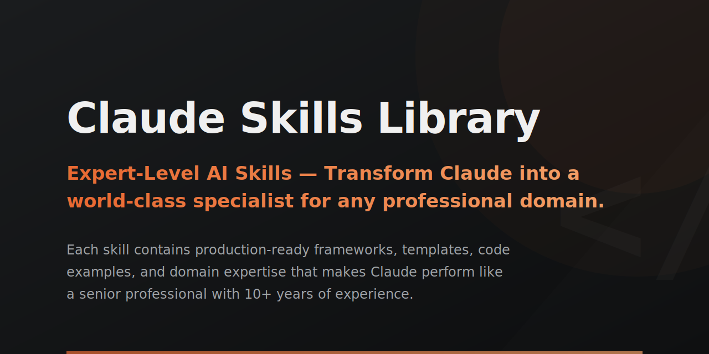

<p align="center">
  
</p>

# Claude Skills Library

**Production-Ready skill packages for Claude AI & Claude Code** — 93 expert-level skills with 92+ Python automation tools, combining best practices, analysis tools, and strategic frameworks across 11 professional domains.

[](https://opensource.org/licenses/MIT)
[](https://claude.ai)
[](https://claude.ai/code)
[](https://github.com/borghei/Claude-Skills)
[](#-skills-library)

---

## Quick Install

**Choose your AI agent:**

### Method 1: Claude Code Native (Recommended)

```bash
# In Claude Code, run:
/plugin marketplace add borghei/Claude-Skills

# Install skill bundles:
/plugin install engineering-skills@claude-code-skills   # 20 engineering skills
/plugin install engineering-advanced@claude-code-skills  # 12 advanced engineering skills
/plugin install marketing-skills@claude-code-skills     # 10 marketing skills
/plugin install product-skills@claude-code-skills       # 7 product skills
/plugin install c-level-skills@claude-code-skills       # 5 C-level advisory skills
/plugin install pm-skills@claude-code-skills            # 9 project management skills
/plugin install ra-qm-skills@claude-code-skills         # 12 regulatory/quality skills
/plugin install business-growth-skills@claude-code-skills  # 3 business & growth skills
/plugin install finance-skills@claude-code-skills       # 1 finance skill
/plugin install data-analytics-skills@claude-code-skills  # 5 data & analytics skills
/plugin install hr-operations-skills@claude-code-skills   # 4 HR & people skills
/plugin install sales-success-skills@claude-code-skills   # 5 sales & success skills

# Or install individual skills:
/plugin install content-creator@claude-code-skills
/plugin install senior-fullstack@claude-code-skills
```

### Method 2: OpenAI Codex

```bash
git clone https://github.com/borghei/Claude-Skills.git
cd Claude-Skills
./scripts/codex-install.sh
```

### Method 3: Universal Installer

```bash
npx agent-skills-cli add borghei/Claude-Skills

# Install to specific agent
npx agent-skills-cli add borghei/Claude-Skills --agent claude
npx agent-skills-cli add borghei/Claude-Skills --agent cursor
```

### Method 4: Direct Use

Copy any `SKILL.md` content and paste it to Claude with your request:

```
[Paste SKILL.md content]

Now help me with: [your specific task]
```

---

## Skills Library (93 Skills)

### Engineering Team (21)
Core engineering expertise with Python automation tools, references, and templates.

| Skill | Description | Tools |
|-------|-------------|-------|
| [senior-architect](engineering-team/senior-architect/SKILL.md) | System design, distributed systems, architectural patterns | 2 |
| [senior-frontend](engineering-team/senior-frontend/SKILL.md) | React patterns, state management, performance, accessibility | 2 |
| [senior-backend](engineering-team/senior-backend/SKILL.md) | API design, microservices, databases, caching, queues | 2 |
| [senior-fullstack](engineering-team/senior-fullstack/SKILL.md) | React, Node.js, databases, API design, system architecture | 3 |
| [senior-qa](engineering-team/senior-qa/SKILL.md) | Test strategy, automation frameworks, performance testing | 2 |
| [senior-devops](engineering-team/senior-devops/SKILL.md) | CI/CD, Kubernetes, Terraform, monitoring, SRE | 2 |
| [senior-secops](engineering-team/senior-secops/SKILL.md) | Security operations, vulnerability management, incident response | 2 |
| [senior-security](engineering-team/senior-security/SKILL.md) | OWASP, threat modeling, penetration testing, compliance | 2 |
| [senior-data-scientist](engineering-team/senior-data-scientist/SKILL.md) | A/B testing, statistical analysis, feature engineering | 3 |
| [senior-data-engineer](engineering-team/senior-data-engineer/SKILL.md) | Airflow, Spark, data pipelines, warehousing | 3 |
| [senior-ml-engineer](engineering-team/senior-ml-engineer/SKILL.md) | ML pipelines, model deployment, MLOps, RAG systems | 3 |
| [senior-prompt-engineer](engineering-team/senior-prompt-engineer/SKILL.md) | Prompt optimization, LLM evaluation, agents | 3 |
| [senior-computer-vision](engineering-team/senior-computer-vision/SKILL.md) | Object detection, image segmentation, model training | 3 |
| [aws-solution-architect](engineering-team/aws-solution-architect/SKILL.md) | Serverless patterns, CloudFormation, cost optimization | 2 |
| [code-reviewer](engineering-team/code-reviewer/SKILL.md) | PR analysis, code quality checking, review automation | 2 |
| [incident-commander](engineering-team/incident-commander/SKILL.md) | Incident response, severity classification, RCA | 3 |
| [ms365-tenant-manager](engineering-team/ms365-tenant-manager/SKILL.md) | Office 365/Azure AD administration | 2 |
| [tdd-guide](engineering-team/tdd-guide/SKILL.md) | Test-driven development workflow | 2 |
| [tech-stack-evaluator](engineering-team/tech-stack-evaluator/SKILL.md) | Framework comparison, TCO analysis | 2 |
| [senior-mobile](engineering-team/senior-mobile/SKILL.md) | React Native, iOS, Android, cross-platform development | - |
| [senior-cloud-architect](engineering-team/senior-cloud-architect/SKILL.md) | AWS, GCP, Azure, multi-cloud, cost optimization | - |

### Advanced Engineering (11)
Enterprise-grade POWERFUL tier skills with sophisticated analysis.

| Skill | Description | Tools |
|-------|-------------|-------|
| [agent-designer](engineering/agent-designer/SKILL.md) | Multi-agent architecture, tool schema generation | 3 |
| [api-design-reviewer](engineering/api-design-reviewer/SKILL.md) | REST API linting, breaking change detection, scoring | 3 |
| [database-designer](engineering/database-designer/SKILL.md) | Schema analysis, ERD generation, index optimization | 3 |
| [dependency-auditor](engineering/dependency-auditor/SKILL.md) | Multi-language dependency scanning, license compliance | 3 |
| [interview-system-designer](engineering/interview-system-designer/SKILL.md) | Interview loop design, question banks, calibration | 3 |
| [migration-architect](engineering/migration-architect/SKILL.md) | Zero-downtime migration planning, rollback strategies | 3 |
| [observability-designer](engineering/observability-designer/SKILL.md) | SLO design, alert optimization, dashboard generation | 3 |
| [rag-architect](engineering/rag-architect/SKILL.md) | RAG pipeline building, chunking optimization | 3 |
| [release-manager](engineering/release-manager/SKILL.md) | Automated changelog, semantic versioning | 3 |
| [skill-tester](engineering/skill-tester/SKILL.md) | Meta-skill validator, quality scoring | 3 |
| [tech-debt-tracker](engineering/tech-debt-tracker/SKILL.md) | AST parsing, debt prioritization, trend analysis | 3 |

### C-Level Advisory (5)
Strategic decision-making for executive leadership.

| Skill | Description | Tools |
|-------|-------------|-------|
| [ceo-advisor](c-level-advisor/ceo-advisor/SKILL.md) | Strategic planning, board governance, investor relations, M&A | 2 |
| [cto-advisor](c-level-advisor/cto-advisor/SKILL.md) | Technical strategy, architecture decisions, engineering leadership | 2 |
| [cfo-advisor](c-level-advisor/cfo-advisor/SKILL.md) | Financial planning, fundraising, unit economics, treasury | - |
| [cmo-advisor](c-level-advisor/cmo-advisor/SKILL.md) | Brand strategy, demand generation, marketing leadership | - |
| [coo-advisor](c-level-advisor/coo-advisor/SKILL.md) | Operations strategy, process optimization, scaling | - |

### Marketing (10)
Data-driven marketing with Python automation tools.

| Skill | Description | Tools |
|-------|-------------|-------|
| [content-creator](marketing-skill/content-creator/SKILL.md) | Brand voice analyzer, SEO optimizer, content frameworks | 2 |
| [marketing-demand-acquisition](marketing-skill/marketing-demand-acquisition/SKILL.md) | Demand gen, paid media, SEO, partnerships | 1 |
| [marketing-strategy-pmm](marketing-skill/marketing-strategy-pmm/SKILL.md) | Positioning, GTM, competitive intelligence | - |
| [app-store-optimization](marketing-skill/app-store-optimization/SKILL.md) | ASO for iOS & Android | - |
| [campaign-analytics](marketing-skill/campaign-analytics/SKILL.md) | Multi-touch attribution, funnel analysis, ROI | 3 |
| [social-media-analyzer](marketing-skill/social-media-analyzer/SKILL.md) | Social media performance tracking, engagement metrics | - |
| [brand-strategist](marketing-skill/brand-strategist/SKILL.md) | Brand positioning, identity systems, brand architecture | - |
| [growth-marketer](marketing-skill/growth-marketer/SKILL.md) | Experimentation, funnel optimization, viral loops, retention | - |
| [marketing-analyst](marketing-skill/marketing-analyst/SKILL.md) | Attribution modeling, ROI analysis, campaign optimization | - |
| [seo-specialist](marketing-skill/seo-specialist/SKILL.md) | Technical SEO, keyword research, link building, analytics | - |

### Product Team (7)
User-centered product development with automation tools.

| Skill | Description | Tools |
|-------|-------------|-------|
| [product-manager-toolkit](product-team/product-manager-toolkit/SKILL.md) | RICE prioritizer, interview analyzer, PRD templates | 2 |
| [agile-product-owner](product-team/agile-product-owner/SKILL.md) | User stories, sprint planning, velocity tracking | 1 |
| [product-strategist](product-team/product-strategist/SKILL.md) | OKR cascade, market analysis, vision setting | 1 |
| [ui-design-system](product-team/ui-design-system/SKILL.md) | Design tokens, component documentation, responsive design | 1 |
| [ux-researcher-designer](product-team/ux-researcher-designer/SKILL.md) | Personas, journey mapping, usability research | 1 |
| [product-designer](product-team/product-designer/SKILL.md) | UI/UX design, prototyping, user research, design systems | - |
| [design-system-lead](product-team/design-system-lead/SKILL.md) | Design tokens, component libraries, documentation | - |

### Project Management (9)
Delivery excellence with Atlassian MCP integration.

| Skill | Description | Tools |
|-------|-------------|-------|
| [senior-pm](project-management/senior-pm/SKILL.md) | Portfolio management, quantitative risk analysis, WSJF | 3 |
| [scrum-master](project-management/scrum-master/SKILL.md) | Sprint analytics, velocity forecasting, team health | 3 |
| [jira-expert](project-management/jira-expert/SKILL.md) | JQL mastery, workflows, automation, dashboards | - |
| [confluence-expert](project-management/confluence-expert/SKILL.md) | Knowledge management, space architecture | - |
| [atlassian-admin](project-management/atlassian-admin/SKILL.md) | System administration, security, integrations | - |
| [atlassian-templates](project-management/atlassian-templates/SKILL.md) | Template design, custom blueprints | - |
| [agile-coach](project-management/agile-coach/SKILL.md) | Transformation, framework implementation, coaching | - |
| [delivery-manager](project-management/delivery-manager/SKILL.md) | Release management, deployment, incident response | - |
| [program-manager](project-management/program-manager/SKILL.md) | Multi-project coordination, portfolio governance | - |

### Regulatory Affairs & Quality Management (12)
HealthTech/MedTech compliance across ISO, MDR, FDA, and GDPR.

| Skill | Description |
|-------|-------------|
| [regulatory-affairs-head](ra-qm-team/regulatory-affairs-head/SKILL.md) | Regulatory strategy, FDA/EU pathways, market access |
| [quality-manager-qmr](ra-qm-team/quality-manager-qmr/SKILL.md) | QMS effectiveness, compliance dashboards |
| [quality-manager-qms-iso13485](ra-qm-team/quality-manager-qms-iso13485/SKILL.md) | ISO 13485 compliance, design control |
| [capa-officer](ra-qm-team/capa-officer/SKILL.md) | CAPA management, root cause analysis |
| [quality-documentation-manager](ra-qm-team/quality-documentation-manager/SKILL.md) | Document control, technical file building |
| [risk-management-specialist](ra-qm-team/risk-management-specialist/SKILL.md) | Risk register, FMEA, ISO 14971 |
| [information-security-manager-iso27001](ra-qm-team/information-security-manager-iso27001/SKILL.md) | ISMS compliance, security risk assessment |
| [gdpr-dsgvo-expert](ra-qm-team/gdpr-dsgvo-expert/SKILL.md) | GDPR/DSGVO compliance, DPIA generation |
| [mdr-745-specialist](ra-qm-team/mdr-745-specialist/SKILL.md) | EU MDR compliance, UDI management |
| [fda-consultant-specialist](ra-qm-team/fda-consultant-specialist/SKILL.md) | FDA submissions, QSR 820 compliance |
| [qms-audit-expert](ra-qm-team/qms-audit-expert/SKILL.md) | Audit planning, finding tracking |
| [isms-audit-expert](ra-qm-team/isms-audit-expert/SKILL.md) | ISMS audit planning, security controls |

### Business Growth (3)
Revenue optimization and customer success with Python tools.

| Skill | Description | Tools |
|-------|-------------|-------|
| [customer-success-manager](business-growth/customer-success-manager/SKILL.md) | Health scoring, churn prediction, expansion analysis | 3 |
| [revenue-operations](business-growth/revenue-operations/SKILL.md) | Pipeline analytics, forecast accuracy, GTM efficiency | 3 |
| [sales-engineer](business-growth/sales-engineer/SKILL.md) | RFP analysis, competitive positioning, POC planning | 3 |

### Finance (1)
Financial analysis and valuation with Python tools.

| Skill | Description | Tools |
|-------|-------------|-------|
| [financial-analyst](finance/financial-analyst/SKILL.md) | DCF valuation, ratio analysis, budget variance, forecasting | 4 |

### Data & Analytics (5)
Data-driven insights and ML operations.

| Skill | Description |
|-------|-------------|
| [data-analyst](data-analytics/data-analyst/SKILL.md) | SQL, visualization, statistical analysis, reporting |
| [data-scientist](data-analytics/data-scientist/SKILL.md) | ML modeling, experimentation, statistical inference |
| [business-intelligence](data-analytics/business-intelligence/SKILL.md) | Dashboard design, KPI development, data storytelling |
| [analytics-engineer](data-analytics/analytics-engineer/SKILL.md) | dbt, data modeling, transformation, semantic layer |
| [ml-ops-engineer](data-analytics/ml-ops-engineer/SKILL.md) | Model deployment, monitoring, feature stores, pipelines |

### Sales & Success (5)
Revenue generation and customer success.

| Skill | Description |
|-------|-------------|
| [account-executive](sales-success/account-executive/SKILL.md) | MEDDIC, pipeline management, negotiation, closing |
| [customer-success-manager](sales-success/customer-success-manager/SKILL.md) | Onboarding, retention, health scoring, expansion |
| [sales-engineer](sales-success/sales-engineer/SKILL.md) | Technical demos, POC design, RFP responses |
| [solutions-architect](sales-success/solutions-architect/SKILL.md) | Solution design, integration architecture, technical sales |
| [sales-operations](sales-success/sales-operations/SKILL.md) | CRM, territory planning, compensation, forecasting |

### HR & People (4)
People operations and workforce analytics.

| Skill | Description |
|-------|-------------|
| [hr-business-partner](hr-operations/hr-business-partner/SKILL.md) | Talent strategy, performance management, org design |
| [talent-acquisition](hr-operations/talent-acquisition/SKILL.md) | Recruiting, sourcing, employer branding, hiring analytics |
| [operations-manager](hr-operations/operations-manager/SKILL.md) | Process optimization, resource management, efficiency |
| [people-analytics](hr-operations/people-analytics/SKILL.md) | Workforce analytics, predictive modeling, survey analysis |

---

## What's Inside Each Skill

### Standard Skill Package Structure

```
skill-name/
├── SKILL.md            # Main skill documentation (100-500 lines)
├── scripts/            # 2-3 Python CLI automation tools
│   ├── tool1.py
│   ├── tool2.py
│   └── tool3.py
├── references/         # 3-4 comprehensive guides
│   ├── framework.md
│   ├── best_practices.md
│   └── examples.md
└── assets/             # User-facing templates
    ├── template1.md
    └── sample_data.json
```

### Python Automation Tools (92+)

All tools are:
- **Standard library only** — no external dependencies
- **CLI-first** with `--help` and `--json` output
- **No API calls** — deterministic local analysis
- **Production-ready** with error handling

Example usage:
```bash
# Financial analysis
python finance/financial-analyst/scripts/dcf_valuation.py valuation_data.json

# Feature prioritization
python product-team/product-manager-toolkit/scripts/rice_prioritizer.py features.csv

# Code quality analysis
python engineering-team/senior-fullstack/scripts/code_quality_analyzer.py /path/to/project

# SEO optimization
python marketing-skill/content-creator/scripts/seo_optimizer.py article.md "keyword"

# Pipeline analytics
python business-growth/revenue-operations/scripts/pipeline_analyzer.py pipeline.json
```

---

## Production Agents

Pre-configured agents for autonomous workflows:

| Agent | Domain | Description |
|-------|--------|-------------|
| [cs-content-creator](agents/marketing/cs-content-creator.md) | Marketing | Content creation with brand voice |
| [cs-demand-gen-specialist](agents/marketing/cs-demand-gen-specialist.md) | Marketing | Demand generation campaigns |
| [cs-ceo-advisor](agents/c-level/cs-ceo-advisor.md) | C-Level | Strategic business planning |
| [cs-cto-advisor](agents/c-level/cs-cto-advisor.md) | C-Level | Technical leadership |
| [cs-product-manager](agents/product/cs-product-manager.md) | Product | Product strategy & execution |

---

## Claude Code Integration

### Slash Commands

```bash
/git:cm    # Commit without push
/git:cp    # Commit and push
/git:pr    # Create pull request
/review    # Run quality checks
/security-scan  # Security validation
```

### Plugin Marketplace

14 plugin bundles available via the marketplace. See [INSTALLATION.md](INSTALLATION.md) for details.

---

## Repository Structure

```
Claude-Skills/
├── .claude/              # Claude Code slash commands
├── .claude-plugin/       # Plugin marketplace config
├── .codex/               # OpenAI Codex compatibility (94 skill symlinks)
├── .github/              # CI/CD workflows, templates, automation
├── agents/               # 5 production agents
├── business-growth/      # 3 skills + 9 Python tools
├── c-level-advisor/      # 5 skills + 4 Python tools
├── data-analytics/       # 5 skills
├── documentation/        # Implementation plans & sprint tracking
├── engineering/          # 12 advanced POWERFUL tier skills + 30 tools
├── engineering-team/     # 20 core engineering skills + 35 tools
├── finance/              # 1 skill + 4 Python tools
├── hr-operations/        # 4 skills
├── marketing-skill/      # 10 skills + 6 Python tools
├── product-team/         # 7 skills + 6 Python tools
├── project-management/   # 9 skills + 5 Python tools
├── ra-qm-team/           # 12 skills + 10 Python tools
├── sales-success/        # 5 skills
├── scripts/              # Utility scripts
├── standards/            # Best practices library
├── templates/            # Reusable templates
├── CLAUDE.md             # Development guide
├── CHANGELOG.md          # Version history
├── CODE_OF_CONDUCT.md    # Community guidelines
├── CONTRIBUTING.md        # Contribution guidelines
├── INSTALLATION.md       # Comprehensive installation guide
├── LICENSE               # MIT License
├── README.md             # This file
└── SECURITY.md           # Security policy
```

---

## Use Cases

### For Individuals
- **Career Development** — Learn expert frameworks for your role
- **Interview Prep** — Understand what senior professionals know
- **Skill Building** — Accelerate your learning curve

### For Teams
- **Onboarding** — Give new hires expert-level context immediately
- **Consistency** — Standardize how your team approaches problems
- **Knowledge Base** — Capture institutional expertise

### For AI Development
- **System Prompts** — Create specialized Claude instances
- **Agent Building** — Equip AI agents with domain expertise
- **Automation** — 92+ Python tools for real workflows

---

## Contributing

See [CONTRIBUTING.md](CONTRIBUTING.md) for detailed guidelines.

### Quick Contribution Guide

1. Fork this repository
2. Create a skill following the standard package structure
3. Include Python tools, references, and assets
4. Ensure comprehensive domain coverage
5. Submit a pull request

### Skill Quality Standards
- YAML frontmatter with metadata
- 100-500 line SKILL.md with progressive disclosure
- 2-3 production-ready Python tools (standard library only)
- 3-4 reference guides
- Reusable templates and assets
- 15-25 keywords for discoverability

---

## Security

See [SECURITY.md](SECURITY.md) for vulnerability reporting and security practices.

---

## License

MIT License — Use freely in personal and commercial projects. See [LICENSE](LICENSE).

---

**93 production-ready skills. 92+ Python tools. 11 professional domains. Built for the Claude community.**
