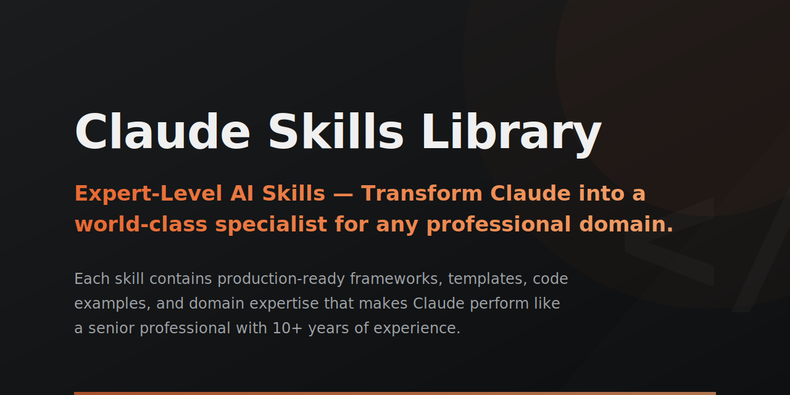

<p align="center">
  
</p>

<h1 align="center">Claude Skills</h1>
<p align="center">Production-ready AI skill packages for every coding assistant</p>

<p align="center">
  <a href="#stats-at-a-glance"></a>
  <a href="#stats-at-a-glance"></a>
  <a href="#platform-support"></a>
  <a href="LICENSE"></a>
  
</p>

---

## What is this?

Claude Skills is the universal AI skills library -- reusable, self-contained skill packages that bundle domain expertise, Python automation tools, reference knowledge bases, and ready-to-use templates. Each skill works as a standalone package you can drop into any AI coding assistant: Claude Code, Codex, Gemini CLI, Cursor, Copilot, Windsurf, Cline, Aider, Goose, and more.

Skills are not plugins or extensions. They are structured knowledge packages that make your AI assistant an expert in a specific domain -- from Terraform infrastructure to SOC 2 compliance to DCF valuation.

---

## Quick Start

### Option A: Clone the full library

```bash
git clone https://github.com/borghei/Claude-Skills.git
cd Claude-Skills

# Browse domains
ls engineering/ marketing/ c-level-advisor/ ra-qm-team/

# Run any Python tool directly
python engineering/senior-fullstack/scripts/code_quality_analyzer.py /path/to/project
```

### Option B: Use the CLI tool

```bash
# Search for skills
python scripts/cs.py search "docker"

# Install a skill into your project
python scripts/cs.py install docker-development --agent claude

# See what's available
python scripts/cs.py stats
```

### Option C: Copy a single skill

```bash
# Grab just the skill you need
cp -r engineering/senior-devops/ ~/.claude/skills/senior-devops

# Or paste the SKILL.md content directly into your AI assistant's context
```

See [INSTALLATION.md](INSTALLATION.md) for the full guide including auto-update configuration and per-agent setup.

---

## Stats at a Glance

| Metric | Count |
|--------|-------|
| **Skills** | 245 |
| **Python Tools** | 653 |
| **Agents & Personas** | 32 |
| **Slash Commands** | 26 |
| **Domains** | 14 |
| **Platforms** | 11 |
| **CI/CD Workflows** | 6 |
| **Compliance Frameworks** | 18 |
| **Standards** | 7 |

---

## Skill Domains

| Domain | Skills | Description | Highlights |
|--------|--------|-------------|------------|
| [**Engineering**](docs/SKILLS.md#engineering) | 76 | Fullstack, DevOps, security, AI/ML, cloud, mobile, data | Docker, Terraform, K8s, Playwright, MCP servers, RAG, observability |
| [**Marketing**](docs/SKILLS.md#marketing) | 38 | Content, SEO, demand gen, paid ads, CRO, social, video | SEO auditor, campaign analytics, A/B testing, X/Twitter growth |
| [**C-Level Advisory**](docs/SKILLS.md#c-level-advisory) | 26 | CEO, CTO, CFO, CISO strategic decision-making | Board governance, fundraising, tech strategy, Virtual Board of Directors |
| [**RA/QM & Compliance**](docs/SKILLS.md#regulatory-affairs-quality-management--compliance) | 21 | Regulatory, quality, security, privacy compliance | ISO 13485, MDR, FDA, SOC 2, GDPR, EU AI Act, NIS2, DORA, HIPAA |
| [**Business & Growth**](docs/SKILLS.md#business-growth) | 16 | Revenue ops, customer success, pricing, churn prevention | CRO, referral programs, pricing optimization, retention analytics |
| [**Legal**](docs/SKILLS.md#legal) | 17 | Contract review, NDA, privacy, DPIA, risk, compliance | Contract analysis, privacy notices, breach response, mediation |
| [**Project Management**](docs/SKILLS.md#project-management) | 13 | Agile, Scrum, Jira, Confluence, sprint planning, DACI | Sprint health, retrospectives, story mapping, DACI governance |
| [**Product Team**](docs/SKILLS.md#product-team) | 8 | Discovery, analytics, roadmaps, UX research, design systems | RICE, OKRs, PESTEL, positioning, TAM-SAM-SOM |
| [**Data Analytics**](docs/SKILLS.md#data--analytics) | 5 | BI, ML ops, analytics engineering, dbt | SQL optimization, data pipelines, business intelligence |
| [**Sales Success**](docs/SKILLS.md#sales--success) | 5 | Account exec, solutions architect, sales ops | MEDDIC, pipeline management, technical sales |
| [**HR Operations**](docs/SKILLS.md#hr--people) | 4 | Talent acquisition, people analytics, HR business partner | Hiring loops, org design, compensation benchmarking |
| [**Finance**](docs/SKILLS.md#finance) | 3 | Financial analyst, SaaS metrics, investment advisor | DCF valuation, ratio analysis, SaaS benchmarks, budgeting |
| [**Standards**](standards/) | 7 | Communication, quality, git, security, orchestration, authoring | Skill Authoring Standard, Orchestration Protocol |

See [docs/SKILLS.md](docs/SKILLS.md) for the complete reference with descriptions and tool counts.

---

## Key Features

### Cross-Domain Personas

7 personas that combine skills from multiple domains into a single expert identity:

`startup-cto` | `growth-marketer` | `solo-founder` | `content-strategist` | `devops-engineer` | `finance-lead` | `product-manager`

Activate with `/persona startup-cto` or by referencing the persona in conversation.

### Compound Sub-Skill Systems

3 deep-dive skill systems with 21 total sub-skills:

- **Playwright Pro** -- Advanced browser automation, testing patterns, and debugging
- **Self-Improving Agent** -- Agents that evaluate and improve their own performance
- **AgentHub** -- Multi-agent orchestration, tool schemas, and communication protocols

### Slash Commands

26 commands for common workflows:

| Command | Purpose |
|---------|---------|
| `/tdd` | Test-driven development workflow |
| `/rice` | RICE-score feature prioritization |
| `/prd` | Generate a product requirements doc |
| `/retro` | Data-driven sprint retrospective |
| `/tech-debt` | Scan and prioritize technical debt |
| `/security-scan` | Run security audit gate |
| `/a11y-audit` | WCAG accessibility audit |
| `/changelog` | Generate changelog from git history |
| `/sprint-plan` | Plan a sprint from backlog |
| `/focused-fix` | Minimal-blast-radius bugfix |

Run `/README` in Claude Code to see the full list.

### Orchestration Protocol

4 multi-agent patterns for complex workflows: sequential pipeline, parallel fan-out, supervisor delegation, and consensus voting. Defined in the [Orchestration Protocol standard](standards/).

### MCP Server

Use skills as Claude Code tools via the built-in MCP server:

```bash
python scripts/mcp_server.py
```

### Starter Bundles

Pre-configured skill sets for common roles:

`SaaS Founder Kit` | `DevOps Kit` | `Compliance Kit` | `Growth Kit` | `Product Kit` | `Data Kit` | `Security Kit` | `Finance Kit`

Install with `python scripts/cs.py bundle saas-founder`.

---

## Platform Support

| Platform | Config File | Status |
|----------|-------------|--------|
| **Claude Code** | `CLAUDE.md` | Native |
| **OpenAI Codex** | `AGENTS.md` | Native |
| **Gemini CLI** | `GEMINI.md`, `.gemini/` | Native |
| **Cursor** | `.cursorrules` | Native |
| **GitHub Copilot** | `.github/copilot-instructions.md` | Native |
| **Windsurf** | `.windsurfrules` | Native |
| **Cline** | `.clinerules` | Native |
| **Aider** | `AGENTS.md` | Compatible |
| **Goose** | `.goosehints` | Native |
| **Jules** | `AGENTS.md` | Compatible |
| **RooCode** | `AGENTS.md` | Compatible |

---

## CLI Tool

```bash
python scripts/cs.py <command>

# Commands
  search <query>       Search skills by keyword
  install <skill>      Install a skill into your project
  list                 List all available skills
  stats                Show library statistics
  doctor               Check skill health and integrity
  bundle <name>        Install a starter bundle
```

---

## Documentation

- **Full docs site:** [docs/](docs/) (MkDocs Material)
- **Skills reference:** [docs/SKILLS.md](docs/SKILLS.md)
- **Agents reference:** [docs/AGENTS.md](docs/AGENTS.md)
- **Usage guide:** [docs/USAGE.md](docs/USAGE.md)
- **Installation:** [INSTALLATION.md](INSTALLATION.md)
- **Contributing:** [CONTRIBUTING.md](CONTRIBUTING.md)
- **Standards:** [standards/](standards/)

---

## Contributing

Contributions welcome. See [CONTRIBUTING.md](CONTRIBUTING.md) for guidelines. Fork the repo, create a skill following the [Skill Authoring Standard](standards/), include Python tools and YAML frontmatter, and submit a PR.

---

## Contributors

| Contributor | GitHub |
|-------------|--------|
| Alan Pope | [@popey](https://github.com/popey) |
| Izzy | [@weemax](https://github.com/weemax) |

---

## Disclaimer

> **This project is built with the assistance of AI tools (Claude, GPT, etc.).** While every effort is made to ensure accuracy, AI-generated content -- including skill definitions, reference guides, Python tools, frameworks, and documentation -- may contain errors, inaccuracies, or outdated information. Always verify critical information independently before using it in production, compliance, legal, financial, or safety-critical contexts. The authors accept no liability for decisions made based on the content in this repository. Use at your own risk.

---

## License

**MIT + Commons Clause** -- Free for open-source, personal, education, and internal business use. Cannot be sold or repackaged as a paid product. See [LICENSE](LICENSE) for full terms.

---

<p align="center">
  <strong>245 skills. 653 tools. 14 domains. 32 agents. 11 platforms.</strong><br>
  <a href="https://borghei.me">borghei.me</a>
</p>

<p align="center">
  <a href="https://buymeacoffee.com/borghei"></a>
</p>
