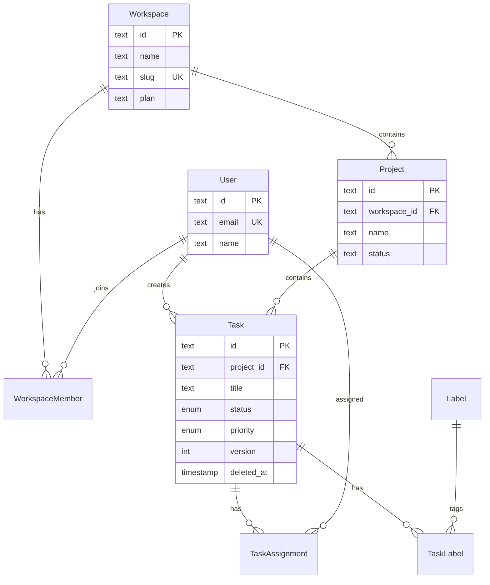

# Database Schema Designer

**Tier:** POWERFUL
**Category:** Engineering / Data Architecture
**Maintainer:** Claude Skills Team

## Overview

Design normalized relational database schemas from requirements and generate migrations, TypeScript/Python types, seed data, Row-Level Security policies, index strategies, and ERD diagrams. Handles multi-tenancy, soft deletes, audit trails, optimistic locking, polymorphic associations, and temporal data patterns. Supports PostgreSQL, MySQL, and SQLite with Drizzle, Prisma, TypeORM, and Alembic.

## Keywords

database schema, schema design, normalization, migration, ERD, row-level security, indexing, multi-tenancy, soft deletes, audit trail, Drizzle, Prisma, PostgreSQL

## Core Capabilities

### 1. Schema Design from Requirements
- Extract entities and relationships from natural language requirements
- Apply normalization rules (1NF through 3NF with denormalization guidance)
- Add cross-cutting concerns: timestamps, soft deletes, audit, versioning
- Generate complete DDL with constraints, defaults, and comments

### 2. Migration Planning
- Generate forward and rollback migrations
- Plan zero-downtime migrations for large tables
- Handle column additions, type changes, and data backfills
- Support Drizzle, Prisma, TypeORM, Alembic, and raw SQL

### 3. Index Strategy
- Composite indexes for common query patterns
- Partial indexes for filtered queries (e.g., active records only)
- Covering indexes to eliminate table lookups
- GIN/GiST indexes for full-text search and JSONB
- Index bloat detection and maintenance

### 4. Type Generation
- TypeScript interfaces and Zod schemas from DB schema
- Python dataclasses and Pydantic models
- Enums as string unions (not database enums for migration safety)

### 5. Security
- Row-Level Security policies for multi-tenant isolation
- Column-level encryption for PII
- Audit logging with before/after JSON snapshots

## When to Use

- Designing tables for a new feature
- Reviewing an existing schema for normalization or performance issues
- Adding multi-tenancy to a single-tenant schema
- Planning a breaking schema migration
- Generating ERD documentation for a service

## Schema Design Process

### Step 1: Requirements to Entities

Given requirements like:
> "Users can create workspaces. Each workspace has projects. Projects contain tasks with assignees, labels, and due dates. We need audit trails and multi-tenant isolation."

Extract entities:
```
User, Workspace, WorkspaceMember, Project, Task, TaskAssignment,
Label, TaskLabel (junction), AuditLog
```

### Step 2: Identify Relationships

```
User 1──* WorkspaceMember *──1 Workspace
Workspace 1──* Project
Project 1──* Task
Task *──* User          (via TaskAssignment)
Task *──* Label         (via TaskLabel)
User 1──* AuditLog
```

### Step 3: Add Cross-Cutting Concerns

Every table gets:
- `id` — CUID2 or UUIDv7 (sortable, non-sequential)
- `created_at` — TIMESTAMPTZ, server-side default
- `updated_at` — TIMESTAMPTZ, updated on every write

Tenant-scoped tables additionally get:
- `workspace_id` — FK to workspaces, included in every query
- RLS policy enforcing workspace isolation

Auditable tables additionally get:
- `created_by_id` — FK to users
- `updated_by_id` — FK to users
- `deleted_at` — TIMESTAMPTZ for soft deletes
- `version` — INTEGER for optimistic locking

### Step 4: Full Schema (Drizzle ORM)

```typescript
import {
  pgTable, text, timestamp, integer, boolean, uniqueIndex, index, pgEnum
} from 'drizzle-orm/pg-core'
import { createId } from '@paralleldrive/cuid2'

// Enums as pgEnum for type safety, but string columns also acceptable
export const taskStatusEnum = pgEnum('task_status', ['todo', 'in_progress', 'in_review', 'done'])
export const taskPriorityEnum = pgEnum('task_priority', ['low', 'medium', 'high', 'urgent'])
export const memberRoleEnum = pgEnum('member_role', ['owner', 'admin', 'member', 'viewer'])

// ──── WORKSPACES ────
export const workspaces = pgTable('workspaces', {
  id: text('id').primaryKey().$defaultFn(createId),
  name: text('name').notNull(),
  slug: text('slug').notNull(),
  plan: text('plan').notNull().default('free'),
  createdAt: timestamp('created_at', { withTimezone: true }).defaultNow().notNull(),
  updatedAt: timestamp('updated_at', { withTimezone: true }).defaultNow().notNull(),
}, (t) => [
  uniqueIndex('workspaces_slug_idx').on(t.slug),
])

// ──── USERS ────
export const users = pgTable('users', {
  id: text('id').primaryKey().$defaultFn(createId),
  email: text('email').notNull(),
  name: text('name'),
  avatarUrl: text('avatar_url'),
  passwordHash: text('password_hash'),
  createdAt: timestamp('created_at', { withTimezone: true }).defaultNow().notNull(),
  updatedAt: timestamp('updated_at', { withTimezone: true }).defaultNow().notNull(),
}, (t) => [
  uniqueIndex('users_email_idx').on(t.email),
])

// ──── WORKSPACE MEMBERS ────
export const workspaceMembers = pgTable('workspace_members', {
  id: text('id').primaryKey().$defaultFn(createId),
  workspaceId: text('workspace_id').notNull().references(() => workspaces.id, { onDelete: 'cascade' }),
  userId: text('user_id').notNull().references(() => users.id, { onDelete: 'cascade' }),
  role: memberRoleEnum('role').notNull().default('member'),
  joinedAt: timestamp('joined_at', { withTimezone: true }).defaultNow().notNull(),
}, (t) => [
  uniqueIndex('workspace_members_unique').on(t.workspaceId, t.userId),
  index('workspace_members_workspace_idx').on(t.workspaceId),
  index('workspace_members_user_idx').on(t.userId),
])

// ──── PROJECTS ────
export const projects = pgTable('projects', {
  id: text('id').primaryKey().$defaultFn(createId),
  workspaceId: text('workspace_id').notNull().references(() => workspaces.id, { onDelete: 'cascade' }),
  name: text('name').notNull(),
  description: text('description'),
  status: text('status').notNull().default('active'),
  ownerId: text('owner_id').notNull().references(() => users.id),
  createdById: text('created_by_id').references(() => users.id),
  updatedById: text('updated_by_id').references(() => users.id),
  createdAt: timestamp('created_at', { withTimezone: true }).defaultNow().notNull(),
  updatedAt: timestamp('updated_at', { withTimezone: true }).defaultNow().notNull(),
  deletedAt: timestamp('deleted_at', { withTimezone: true }),
}, (t) => [
  index('projects_workspace_idx').on(t.workspaceId),
  index('projects_workspace_status_idx').on(t.workspaceId, t.status),
])

// ──── TASKS ────
export const tasks = pgTable('tasks', {
  id: text('id').primaryKey().$defaultFn(createId),
  projectId: text('project_id').notNull().references(() => projects.id, { onDelete: 'cascade' }),
  title: text('title').notNull(),
  description: text('description'),
  status: taskStatusEnum('status').notNull().default('todo'),
  priority: taskPriorityEnum('priority').notNull().default('medium'),
  position: integer('position').notNull().default(0),
  dueDate: timestamp('due_date', { withTimezone: true }),
  version: integer('version').notNull().default(1),
  createdById: text('created_by_id').notNull().references(() => users.id),
  updatedById: text('updated_by_id').references(() => users.id),
  createdAt: timestamp('created_at', { withTimezone: true }).defaultNow().notNull(),
  updatedAt: timestamp('updated_at', { withTimezone: true }).defaultNow().notNull(),
  deletedAt: timestamp('deleted_at', { withTimezone: true }),
}, (t) => [
  index('tasks_project_idx').on(t.projectId),
  index('tasks_project_status_idx').on(t.projectId, t.status),
  index('tasks_due_date_idx').on(t.dueDate).where(sql`deleted_at IS NULL`),
])

// ──── AUDIT LOG ────
export const auditLog = pgTable('audit_log', {
  id: text('id').primaryKey().$defaultFn(createId),
  workspaceId: text('workspace_id').notNull().references(() => workspaces.id),
  userId: text('user_id').notNull().references(() => users.id),
  action: text('action').notNull(), // 'create' | 'update' | 'delete'
  entityType: text('entity_type').notNull(), // 'task' | 'project' | etc.
  entityId: text('entity_id').notNull(),
  before: text('before'), // JSON snapshot
  after: text('after'),   // JSON snapshot
  ipAddress: text('ip_address'),
  createdAt: timestamp('created_at', { withTimezone: true }).defaultNow().notNull(),
}, (t) => [
  index('audit_log_workspace_idx').on(t.workspaceId),
  index('audit_log_entity_idx').on(t.entityType, t.entityId),
  index('audit_log_user_idx').on(t.userId),
  index('audit_log_created_idx').on(t.createdAt),
])
```

## Row-Level Security (PostgreSQL)

```sql
-- Enable RLS on tenant-scoped tables
ALTER TABLE projects ENABLE ROW LEVEL SECURITY;
ALTER TABLE tasks ENABLE ROW LEVEL SECURITY;

-- Create application role
CREATE ROLE app_user;

-- Projects: users can only see projects in their workspace
CREATE POLICY projects_workspace_isolation ON projects
  FOR ALL TO app_user
  USING (
    workspace_id IN (
      SELECT wm.workspace_id FROM workspace_members wm
      WHERE wm.user_id = current_setting('app.current_user_id')::text
    )
  );

-- Tasks: access through project's workspace membership
CREATE POLICY tasks_workspace_isolation ON tasks
  FOR ALL TO app_user
  USING (
    project_id IN (
      SELECT p.id FROM projects p
      JOIN workspace_members wm ON wm.workspace_id = p.workspace_id
      WHERE wm.user_id = current_setting('app.current_user_id')::text
    )
  );

-- Soft delete filter: never show deleted records to app users
CREATE POLICY tasks_hide_deleted ON tasks
  FOR SELECT TO app_user
  USING (deleted_at IS NULL);

-- Set user context at request start (in middleware)
-- SELECT set_config('app.current_user_id', $1, true);
```

## Index Strategy Decision Framework

```
Query Pattern                          → Index Type
─────────────────────────────────────────────────────
WHERE col = value                      → B-tree (default)
WHERE col1 = v1 AND col2 = v2         → Composite B-tree (col1, col2)
WHERE col = value AND deleted_at IS NULL → Partial index with WHERE clause
WHERE col IN (v1, v2, v3)             → B-tree (handles IN efficiently)
WHERE col LIKE 'prefix%'              → B-tree (prefix match only)
WHERE col LIKE '%substring%'          → GIN with pg_trgm extension
WHERE jsonb_col @> '{"key": "val"}'   → GIN on JSONB column
WHERE to_tsvector(col) @@ query       → GIN on tsvector
ORDER BY col DESC LIMIT N             → B-tree DESC
SELECT a, b WHERE a = v               → Covering index INCLUDE(b)
```

### Index Anti-Patterns

| Anti-Pattern | Why It Hurts | Fix |
|-------------|-------------|-----|
| Index on every column | Write overhead, storage bloat | Index only queried columns |
| No index on foreign keys | Slow JOINs and CASCADE deletes | Always index FK columns |
| Missing partial index for soft deletes | Full table scan on `WHERE deleted_at IS NULL` | Add `WHERE deleted_at IS NULL` to index |
| Composite index in wrong order | Index unused for prefix queries | Put most selective / equality column first |
| No index maintenance | Bloated indexes, slow queries | Schedule REINDEX CONCURRENTLY |

## Zero-Downtime Migration Patterns

### Adding a NOT NULL Column to a Large Table

```sql
-- WRONG: locks table for duration of ALTER
ALTER TABLE tasks ADD COLUMN assignee_id TEXT NOT NULL;

-- RIGHT: three-phase migration
-- Phase 1: Add nullable column (instant, no lock)
ALTER TABLE tasks ADD COLUMN assignee_id TEXT;

-- Phase 2: Backfill in batches (no lock)
UPDATE tasks SET assignee_id = created_by_id
WHERE assignee_id IS NULL AND id > $last_processed_id
LIMIT 10000;
-- Repeat until all rows backfilled

-- Phase 3: Add NOT NULL constraint (brief lock, but validates existing data)
ALTER TABLE tasks ALTER COLUMN assignee_id SET NOT NULL;
```

### Renaming a Column Safely

```sql
-- WRONG: ALTER TABLE RENAME COLUMN breaks all running code instantly

-- RIGHT: expand-contract pattern
-- Phase 1: Add new column, write to both
ALTER TABLE tasks ADD COLUMN assignee_user_id TEXT;
-- Deploy code that writes to BOTH old_name and new_name

-- Phase 2: Backfill
UPDATE tasks SET assignee_user_id = old_assignee WHERE assignee_user_id IS NULL;

-- Phase 3: Switch reads to new column
-- Deploy code that reads from new_name only

-- Phase 4: Drop old column (after all deployments use new name)
ALTER TABLE tasks DROP COLUMN old_assignee;
```

## ERD Generation (Mermaid)



## Common Pitfalls

- **No index on foreign keys** — every FK column needs an index for JOIN and CASCADE performance
- **Soft deletes without partial index** — `WHERE deleted_at IS NULL` without index causes full table scans
- **Sequential integer IDs exposed in URLs** — reveals entity count; use CUID2 or UUIDv7 instead
- **Adding NOT NULL to a large table** — locks the table; use the three-phase pattern above
- **Database enums for status fields** — altering enums requires migration; use text with CHECK constraint
- **No optimistic locking** — concurrent updates silently overwrite each other; add a `version` column
- **RLS not tested** — always test RLS policies with a non-superuser role in staging
- **Missing updated_at trigger** — without a trigger, updated_at only updates when application code remembers to set it

## Best Practices

1. **Timestamps on every table** — `created_at` and `updated_at` as TIMESTAMPTZ with server defaults
2. **Soft deletes for user-facing data** — `deleted_at` instead of hard DELETE for audit and recovery
3. **CUID2 or UUIDv7 as primary keys** — sortable, non-sequential, globally unique
4. **Index every foreign key column** — required for JOIN performance and CASCADE operations
5. **Partial indexes for filtered queries** — `WHERE deleted_at IS NULL` saves significant scan time
6. **RLS over application-level filtering** — the database enforces tenancy, not just application code
7. **Version column for optimistic locking** — `WHERE version = $expected_version` prevents lost updates
8. **Audit log with JSON snapshots** — store before/after state for compliance and debugging

## Troubleshooting

| Problem | Cause | Solution |
|---------|-------|----------|
| Migration locks table for minutes | Adding NOT NULL column or index on large table without batching | Use the three-phase migration pattern: add nullable, backfill in batches, then set NOT NULL |
| RLS policies silently return empty results | `current_setting('app.current_user_id')` not set before query | Verify middleware calls `set_config` at the start of every request; add a test that queries as a non-superuser role |
| Composite index not used by query planner | Columns in the WHERE clause do not match the index prefix order | Reorder index columns so equality predicates come first, then range predicates; run `EXPLAIN ANALYZE` to confirm |
| Soft-deleted records appear in API responses | Application queries missing `WHERE deleted_at IS NULL` filter | Add a default scope or database view that excludes soft-deleted rows; prefer RLS policy for enforcement |
| Optimistic locking conflicts spike after deploy | New code path writes without incrementing the `version` column | Audit all UPDATE statements to include `SET version = version + 1` and `WHERE version = $expected` |
| Foreign key CASCADE deletes are slow | Missing index on the child table's FK column | Add a B-tree index on every FK column; verify with `EXPLAIN` on a DELETE of the parent row |
| CUID2/UUIDv7 IDs cause index bloat over time | Text-based IDs are wider than integers, increasing B-tree page splits | Schedule `REINDEX CONCURRENTLY` during low-traffic windows; monitor `pg_stat_user_indexes` for bloat ratio |

## Success Criteria

- **Schema passes 3NF validation** — no transitive dependencies remain unless documented as intentional denormalization for read performance
- **All foreign key columns are indexed** — zero FK columns without a corresponding B-tree index, verified via `pg_indexes` query
- **Zero-downtime migrations verified** — every migration executes without `ACCESS EXCLUSIVE` locks exceeding 5 seconds on tables with 100K+ rows
- **RLS policies tested with non-superuser role** — at least one integration test per tenant-scoped table confirms cross-tenant data isolation
- **Type generation matches schema** — generated TypeScript interfaces or Pydantic models have zero drift from the current DDL, validated in CI
- **Query performance meets SLA** — 95th percentile query latency under 50ms for indexed queries on tables up to 10M rows
- **Audit log captures all mutations** — every INSERT, UPDATE, and DELETE on auditable tables produces a corresponding audit_log entry with before/after snapshots

## Scope & Limitations

**This skill covers:**
- Relational schema design for PostgreSQL, MySQL, and SQLite including normalization through 3NF
- Migration generation and zero-downtime migration planning for Drizzle, Prisma, TypeORM, and Alembic
- Row-Level Security policies, index strategy, and type generation (TypeScript and Python)
- Cross-cutting patterns: multi-tenancy, soft deletes, audit trails, optimistic locking, and temporal data

**This skill does NOT cover:**
- NoSQL or document database design (MongoDB, DynamoDB, Cassandra) — see `senior-data-engineer` for broader data store guidance
- Query optimization and execution plan analysis beyond index recommendations — see `performance-profiler` for runtime profiling
- Database infrastructure provisioning, replication, or failover configuration — see `senior-cloud-architect` for cloud database setup
- Application-layer ORM patterns, connection pooling, or caching strategies — see `senior-backend` for backend architecture decisions

## Integration Points

| Skill | Integration | Data Flow |
|-------|-------------|-----------|
| `migration-architect` | Hands off generated DDL and migration files for sequencing across services | Schema Designer produces migrations, Migration Architect orchestrates cross-service rollout order |
| `api-design-reviewer` | Schema entities map directly to API resource models and endpoint structure | Schema entities and relationships feed into REST/GraphQL resource definitions and validation rules |
| `senior-backend` | Generated types and ORM schemas plug into repository and service layers | TypeScript interfaces and Pydantic models from schema become the backend's data access contracts |
| `performance-profiler` | Index strategy recommendations are validated against real query execution plans | Schema Designer proposes indexes, Performance Profiler confirms effectiveness with `EXPLAIN ANALYZE` data |
| `senior-secops` | RLS policies and column encryption align with security compliance requirements | Security requirements flow in, RLS policies and encryption specifications flow out for audit verification |
| `observability-designer` | Audit log schema provides the foundation for operational dashboards and alerting | Audit log table structure feeds into observability pipelines for change tracking and anomaly detection |
